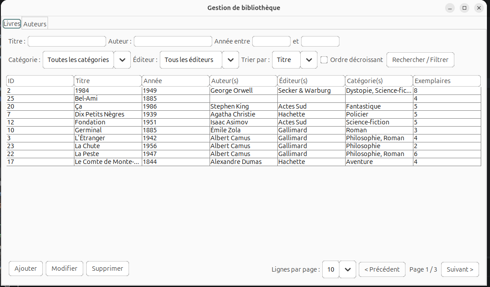
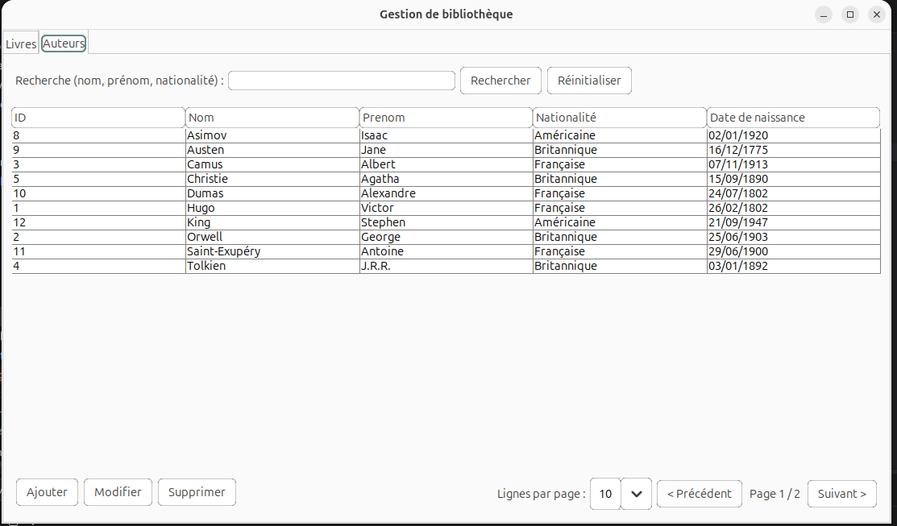

# 📚 Gestion de bibliothèque

Application de bureau (Java Swing) permettant de gérer le catalogue d'une
bibliothèque : livres, auteurs, éditeurs et catégories, avec recherche
multicritère, filtres, tri et pagination.


## Aperçu

### Onglet Livres — recherche, filtres, tri et pagination


### Onglet Auteurs — recherche et pagination


## Fonctionnalités

### Livres
- ➕ Ajout, ✏️ modification, 🗑️ suppression d'un livre
- Association à un ou plusieurs **auteurs**, **éditeurs** et **catégories**
  (relations plusieurs-à-plusieurs)
- Création d'un nouvel auteur / éditeur / catégorie directement depuis le
  formulaire d'ajout d'un livre
- **Recherche multicritère** : titre, nom d'auteur, plage d'années
- **Filtres** : par catégorie, par éditeur
- **Tri** : par titre ou par année, croissant/décroissant
- **Pagination** : taille de page réglable (5/10/20/50), navigation page par page
- Confirmation avant toute suppression

### Auteurs
- Ajout, modification, suppression
- Recherche par nom, prénom ou nationalité
- Pagination

## Architecture

Le projet suit une architecture en couches **MVC + Service + DAO** :

```
View (Swing)  →  Controller  →  Service (validation métier)  →  DAO (JDBC)  →  MySQL
```

```
src/main/java/com/bibliotheque/
├── Main.java
├── model/          # Livre, Auteur, Editeur, Categorie
├── dao/             # Accès aux données (JDBC / SQL)
├── service/          # Règles de validation métier
├── controller/       # Lien entre la vue et les services
└── view/              # Fenêtres et composants Swing (JTable, formulaires...)
```

| Couche | Rôle |
|---|---|
| **Model** | Objets métier simples (POJO) |
| **DAO** | Requêtes SQL via `PreparedStatement`, gestion des tables de jointure |
| **Service** | Validation des données avant écriture en base |
| **Controller** | Fait le pont entre les événements de l'interface et les services |
| **View** | Fenêtres, tableaux (`JTable`), formulaires (`JDialog`) |

## Base de données

7 tables : `livre`, `auteur`, `editeur`, `categorie`, et trois tables de
jointure (`livre_auteur`, `livre_editeur`, `livre_categorie`) pour gérer les
relations plusieurs-à-plusieurs.

Le script complet se trouve dans [`sql/bibliotheque.sql`](sql/bibliotheque.sql).

## Installation

### Prérequis
- JDK 17 ou supérieur
- MySQL 8 (ou MariaDB compatible)
- Le pilote JDBC [`mysql-connector-j`](https://dev.mysql.com/downloads/connector/j/)

### 1. Créer la base de données

```bash
mysql -u root -p < sql/bibliotheque.sql
```

### 2. Configurer la connexion

Éditer `src/main/java/com/bibliotheque/dao/ConnexionBD.java` :

```java
private static final String URL = "jdbc:mysql://localhost:3306/bibliotheque?useSSL=false&serverTimezone=UTC";
private static final String UTILISATEUR = "root";
private static final String MOT_DE_PASSE = "root";
```

### 3. Compiler et lancer

```bash
javac -cp "lib/mysql-connector-j.jar" -d out $(find src -name "*.java")
java -cp "out:lib/mysql-connector-j.jar" com.bibliotheque.Main
```

*(sous Windows, remplacer `:` par `;` dans le classpath)*

## Jeu de données de test

Un script optionnel [`sql/test-data.sql`](sql/test-data.sql) permet de
peupler la base avec 25 livres, 12 auteurs, 6 éditeurs et 8 catégories pour
tester rapidement la recherche, les filtres, le tri et la pagination.

## Technologies

- Java 17+ / Swing
- JDBC (MySQL Connector/J)
- MySQL 8

## Licence

Projet académique — libre d'utilisation à des fins pédagogiques.
